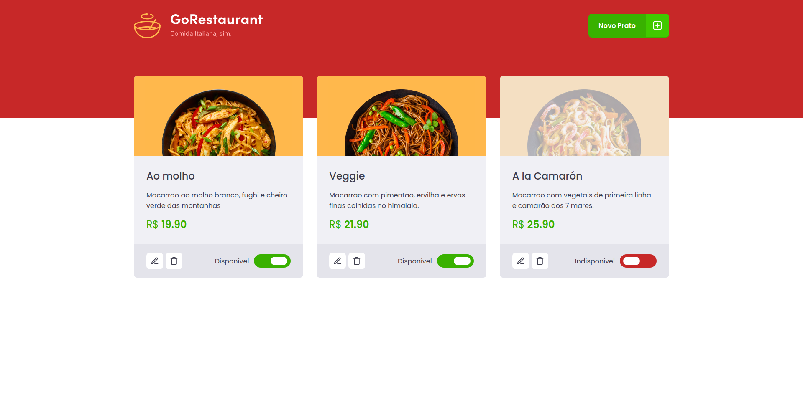

<p align="center">
  <a></a>
</p>

This is the second optional challenge of the Rocketseat Ignite course.

🚀 In this challenge, we had to added Typescript and transform all Class Component (CF) into Functional Components (FC)

<p align="center">
  <a></a>
</p>

<p align="center">
  <a></a>
</p>

## 🛠️ Stack

- React
- Typescript
- useState, useEffect
- styled-components
- react-modal
- json-server

## Run

```
    yarn install
    yarn dev
```

## :woman: Author

[@laisfrigerio](https://github.com/laisfrigerio/)

## 📄 License

This project is licensed under the MIT License - see the LICENSE file for details